# Forecasting the Stock Market with Watson Studio

In this code pattern, we will demonstrate on how subject matter experts and data scientists can leverage IBM Watson Studio to automate data mining and the training of time series forecasters using open-source machine learning libraries, or the built-in graphical tool integrated into Watson Studio. It applies ARIMA algorithms (Auto-regressive Integrated Moving Average) and other advanced techniques to construct mathematical models capable of predicting trends based on data from the past.

Using the IBM Watson Studio and other popular open-source Python libraries for data science, this code pattern provides an example of data science workflow which attempts to predict the end-of-day value of S&P 500 stocks based on historical data. It includes the data mining process, that uses the Quandl API – a marketplace for financial, economic and alternative data delivered in modern formats for today's analysts.

When the reader has completed this Code Pattern, they will understand how to:

* Use Jupyter Notebooks in Watson Studio to mine financial data using public APIs.
* Use specialized Watson Studio tools like Data Refinery to prepare data for model training.
* Build, train, and save a timeseries model from extracted data, using open-source Python libraries and/or the built-in graphical Modeler Flow in Watson Studio.
* Interact with IBM Cloud Object Storage to store and access mined and modeled data.
* Store a model created with Modeler Flow and interact with the Watson Machine Learning service using the Python API.
* Generate graphical visualizations of timeseries data using Pandas and Bokeh.

## Flow

1. Create a Watson Studio project.
2. Assign a Cloud object storage to it.
3. Load Jupyter notebook to Watson Studio.
4. The sample data provided by Quandl API is imported by the notebook.
5. Data imported are refined by Data Refinery and saved to Cloud object storage.
6. Using SPSS modeler flow to create forecasts
7. Importing the Watson Machine Learning model exported from SPSS modeler flow to Watson Machine Learning.
8. Exposing Watson Machine Learning model through an API.
9. Application use Watson Machine Learning API to create stock market predicitons.

## Steps

1. [Create a new project in Watson Studio](#1-create-a-new-project-in-watson-studio)
2. [Mining data and making forecasts with a Python notebook](#2-mining-data-and-making-forecasts-with-a-python-notebook)
3. [Configuring the Quandl API key](#3-configuring-the-quandl-api-key)
4. [Configuring the IBM Cloud Object Storage credentials in the notebook](#4-configuring-the-ibm-cloud-object-storage-credentials-in-the-notebook)
5. [Importing the mined data as an asset into the Watson Studio project](#5-importing-the-mined-data-as-an-asset-into-the-watson-studio-project)
6. [Cleansing data with Data Refinery](#6-cleansing-data-with-data-refinery)
7. [Making forecasts with SPSS modeler flow](#7-making-forecasts-with-spss-modeler-flow)
8. [Visualizing modeler flow Results with a Python notebook](#8-deploying-the-modeler-flow-model-with-watson-machine-learning)
9. [Deploying a Modeler flow model in Watson Machine Learning](#9-using-and-validating-the-model-stored-in-wml)

### 1. Create a new project in Watson Studio

* Log into IBM's [Watson Studio](https://dataplatform.cloud.ibm.com). Once in, you'll land on the dashboard.

* Create a new project by clicking `+ New project` and choosing `Data Science`:

  

* Enter a name for the project name and click `Create`.

* **NOTE**: By creating a project in Watson Studio a free tier `Object Storage` service and `Watson Machine Learning` service will be created in your IBM Cloud account. Select the `Free` storage type to avoid fees.

  

* Upon a successful project creation, you are taken to a dashboard view of your project. Take note of the `Assets` and `Settings` tabs, we'll be using them to associate our project with any external assets (datasets and notebooks) and any IBM cloud services.

  

### 2. Mining Data and Making forecasts with a Python Notebook

* From the new project `Overview` panel, click `+ Add to project` on the top right and choose the `Notebook` asset type.

  

* Fill in the following information:

  * Select the `From URL` tab. [1]
  * Enter a `Name` for the notebook and optionally a description. [2]
  * Under `Notebook URL` provide the following url: [https://github.com/IBM/watson-stock-market-predictor/blob/master/notebooks/forecasting-the-stock-market.ipynb](https://github.com/IBM/watson-stock-market-predictor/blob/master/notebooks/forecasting-the-stock-market.ipynb) [3]
  * For `Runtime` select the `Spark Python 3.6` option. [4]

  

* Click the `Create` button.

* **TIP:** Once successfully imported, the notebook should appear in the `Notebooks` section of the `Assets` tab.

From now on the Python Notebook is ready and can be started by clicking at the `Run` button indicated in the picture below. You can read the instructions and comments in the notebook and start executing cell by cell.

There are only two steps that require further action now - the provisioning of an [API key for the Quandl database](https://www.quandl.com/sign-up-modal?defaultModal=showSignUp) (that can be done for free at the Quandl website, and the configuration of the IBM Cloud Object Storage credentials at section 4 of the Notebook.

### 3. Configuring the Quandl API key

After registering for a free API key at the Quandl website, you just need to write it at the indicated cell, as shown below.

After this step you can execute all the cells - where all the data science is done! - until section 4

### 4. Configuring the IBM Cloud Object Storage credentials in the Notebook

This step is required so you can export the mined data and also the results of the forecaster to IBM Cloud Object Storage. Using the IBM Cloud Object Storage API you can then use the stored data as you wish (publication, further analysis with different tools, etc). In the cell indicated at the picture below, you must replace the `variable cos_credentials` with your IBM Cloud Object Storage credentials.

There is an easy way to do this. First, click at the indicated button in the top right corner of the screen and upload the [`AAPL.csv`](data/AAPL.csv) file.

The file will appear at the right side panel. Click at `Insert to code` and then `Insert credentials`, as shown below. Your credentials will appear at the selected cell.

### 5. Importing the Mined Data as an Asset into the Watson Studio Project

Don't forget that the variable with the credentials must be named `cos_credentials` for the defined function (in the next cell) to work. You are now ready to upload the two csv files generated, by the analysis to the IBM Cloud Object Storage service.

After executing all the remaining cells in the Notebook, if you go back to the `Assets` tab and click in the indicated buttons below, you will be able to see some new files - in the picture: `AAPL.csv` (the file you manually uploaded), `IBM.csv` (IBM financial data downloaded from Quandl) and `IBM_future.csv` (the predictions generated by the machine learning model). Import these files as assets to your project.

I'll be able to see the new data assets at the `Assets` tab:

### 6. Cleansing Data with Data Refinery

In this step we are going to use Data Refinery to cleanse data - the imported csv files (AAPL.csv, or other financial data collected by you with the Python Notebook). First, click at the `Add to project` blue button at the top right corner and select a new `DATA REFINERY FLOW`.

Next, you should choose the target csv file (the `AAPL.csv` file is chosen in this example).

After Data Refinery reads the target file, you will see the following screen:

From the sample data shown at the table in the picture above, we can see that there are some problems with the source data: the columns are unnamed, the data types are incorrect, there is an useless index column, and the first row of the table (the labels of the columns) should be dropped. In the next following steps we are going to create a Flow of actions to fix these problems.

First we remove the first row (labels) by clicking at the "triple dots" at `COLUMN1` and then `Remove empty rows`.

Then we remove the first column (the useless one) by clicking at the triple dots at `COLUMN1` and then `Remove`.

Now we'll change the data types. First, click at the triple dots at `COLUMN2` followed by `CONVERT COLUMN` and then choose `Date`.

In the next screen (shown below), choose the `ymd` order (year-month-day) at the left side panel and click `Apply`.

Lastly, you should change the data types for `COLUMN3`, `COLUMN4`, `COLUMN5`, and `COLUMN6` from String to Decimal. This can be done by clicking at the triple dots followed by `CONVERT COLUMN` and then choosing `Decimal`.

After converting the four columns to Decimal types, you should see something like this (Five columns (one with type Date and four with type Decimal) and a flow with 7 steps):

If everything is correct, click at the `Run Data Refinery Flow` button at the top right corner (shown in the picture above), and then click at `Save and Run Flow` in the next screen.

After the Data Refinery Flow is completed, you will be able to see a new csv file at the Assets tab (`AAPL.csv_shaped.csv`):

This csv file will be the input for SPSS Modeler Flow that will be created next.

### 7. Making forecasts with SPSS Modeler Flow

With the cleansed `AAPL.shaped_csv.csv` file we can proceed to create the Modeler Flow for forecasting future stock values. Click at the `Add to project` blue button at the top right corner and select a new `MODELER FLOW`.

In the Modeler Flow creation page, select the `From file` option and upload the [`forecasting-stocks-with-spss-modeler.str`](modeler-flows/forecasting-stocks-with-spss-modeler.str) file (provided in this repository). Click at `Create`.

After Watson Studio finishes loading, you will see the flow shown in the picture below. This flow consists on an `Data Asset` block, where we set the source file; a `Filter` block that is used to rename the columns; a `Type` block, used to set the target and input columns; a `Sample` block, to split the source data into train and test datasets; and a `Time Series` modeler block, to generate the predictions. The dark blue blocks are outputs.

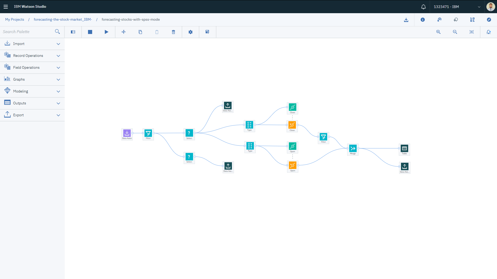

Before executing it, we need to set the source data. To do this, click at the `Data Asset` block and select in the right panel the `<STOCK_TICKER>.shaped_csv.csv` file (AAPL in this example).

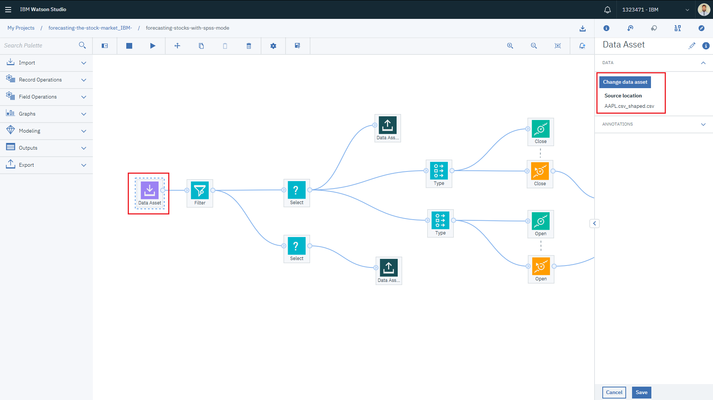

Click `Save` and then `Run` at the indicated button:

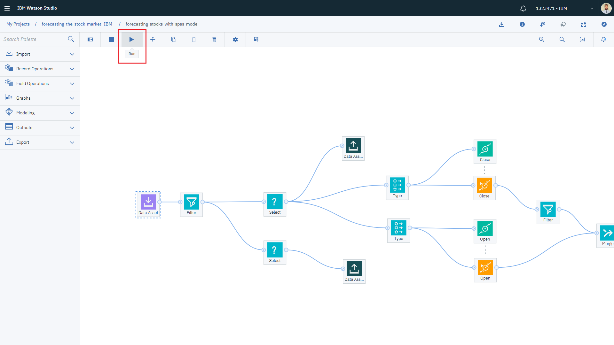

After the flow finishes execution, you will be able to see the outputs at the right panel.

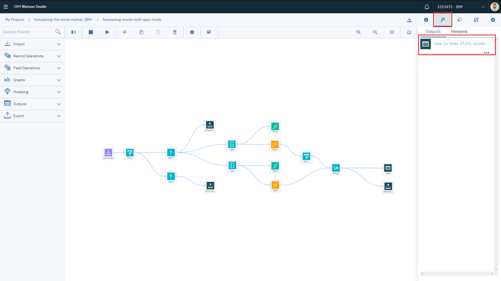

### 8. Deploying the Modeler Flow Model with Watson Machine Learning

In this section you'll learn on how to store a model trained with Watson Studio Modeler Flow and also how to make API calls to your stored model, deployed as a Web Service in an instance of the Watson Machine Learning service.

First, go back to the Modeler Flow canvas and right-click the `Table` output node and select `Save branch as a model`, as indicated in the picture below:

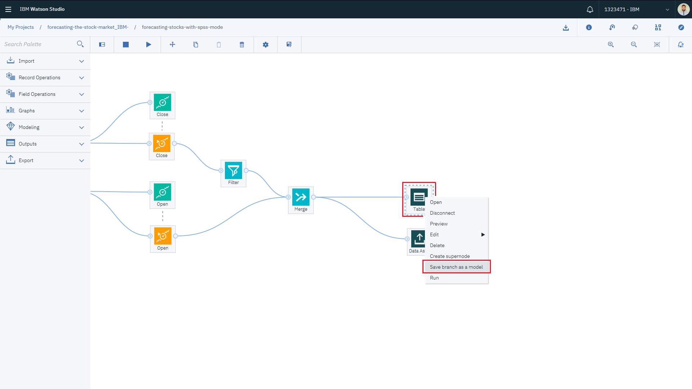

You'll be directed to the `Save Model` page. Save the model as `Scoring Branch` and give a name and description to your model. In this case, the model predicts the closing end-of-day value for Apple Inc. stocks. You also need to select an instance of Watson Machine Learning, previously created in the beggining of this tutorial. In the picture below the WML instance is named `ibmdegla-watson-ml`.

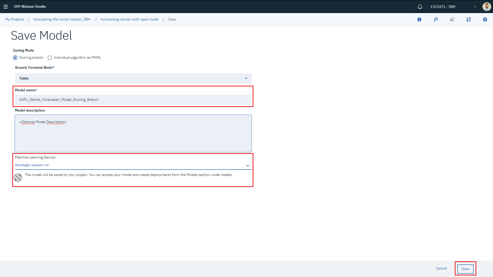

After saving the model you'll be able to see it in the Watson Studio project `Assets` tab. Click on the saved model (in the picture below the model is named `AAPL_Model_Scoring_Branch_v2`):

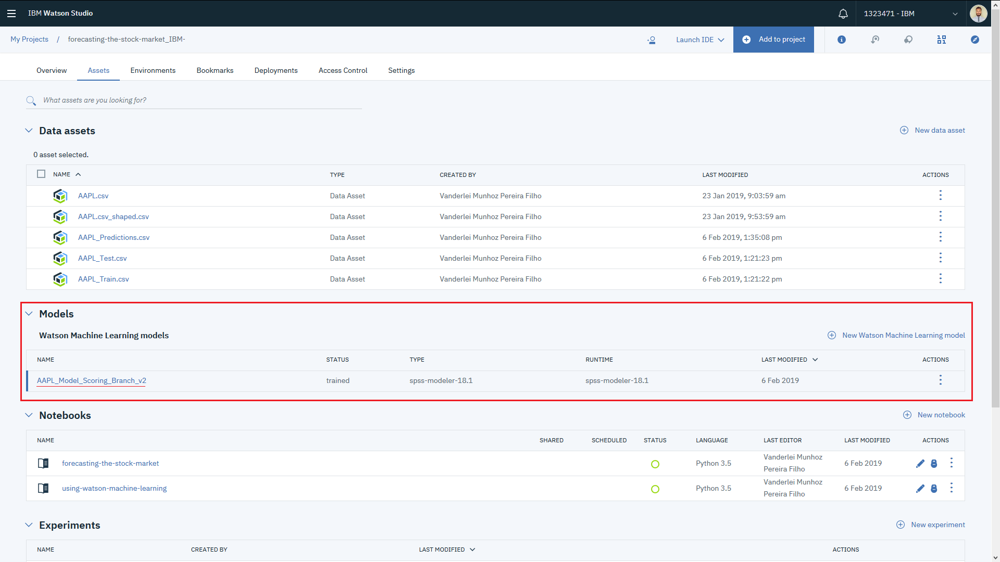

You will see now some information about your saved model, like the input schema and running environment. Click on the deployments tab.

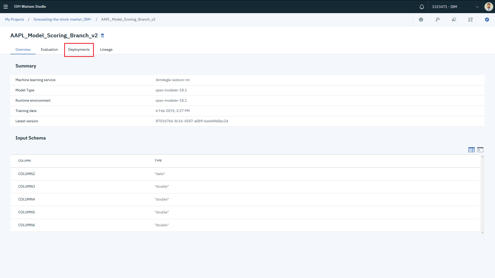

Click in `Add deployment`, in the right side of the screen:

Give a name and description to your model deployment and click `Save`.

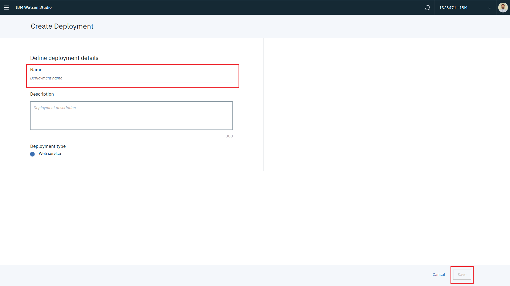

After the deployment is finished, you will see `DEPLOY_SUCCESS` in the status field. Click in the deployment (in the picture below the deployment is named `AAPL_Model_Deployment`).

Then click at the `Implementation` tab

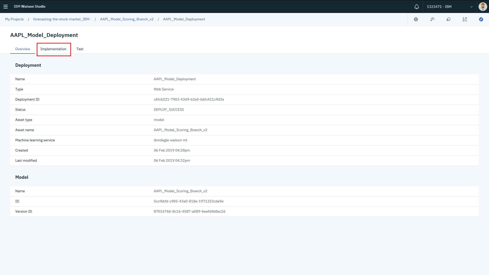

Copy the `Scoring End-Point` link to your clipboard, as it will be needed later when calling the Watson Machine Learning API. You can also let this browser tab open so you can copy the link later when needed.

### 9. Using and Validating the Model Stored in WML

After successfully deploying the Apple Inc. stock value forecaster in a Watson Machine Learning instance, you are now able to send new input data to be scored by the model using the generated API. In this section it's demonstrated how to interact with Watson Machine Learning using another Python Notebook.

Just as it was done before (see Step 2), add a new Notebook asset to your project clicking in the `Add to project` blue button at the top-right corner.

Select the `From URL` option, and paste the following link at the indicated field: [`https://github.com/IBM/watson-stock-market-predictor/blob/master/notebooks/using-watson-machine-learning.ipynb`](https://github.com/IBM/watson-stock-market-predictor/blob/master/notebooks/using-watson-machine-learning.ipynb).

Click `Create notebook` in the bottom-right corner.

After Watson Studio finishes loading the Python kernel, you will see the following:

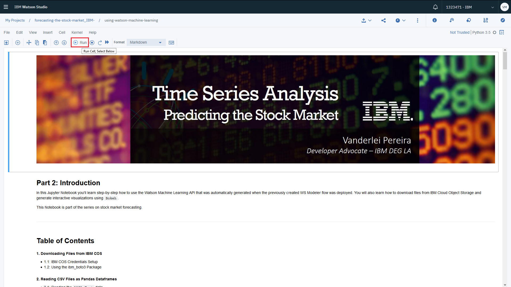

You can execute cell by cell until the part where IBM COS must be configured.

You have - again - to configure the IBM Cloud Object Storage service credentials. You can use the same easy procedure presented earlier to do this (See Step 4).

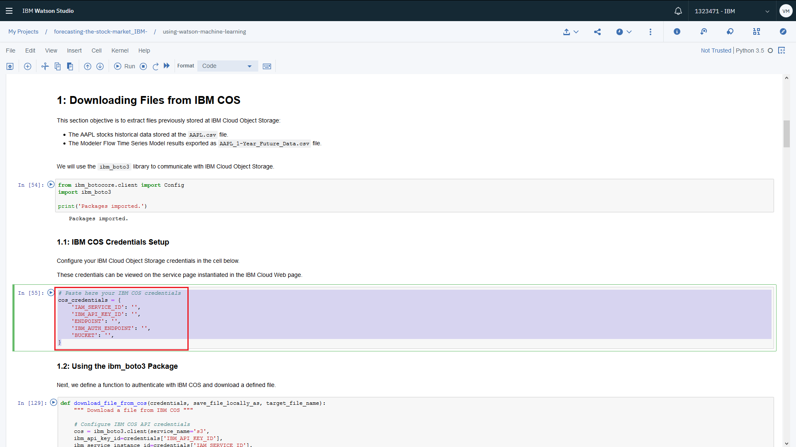

After configuring IBM COS, the Python Notebook will be able to fetch the csv file with the mined Apple Inc stock data.

You then execute the next cells until section `3.2: Setting Up WML Credentials`.

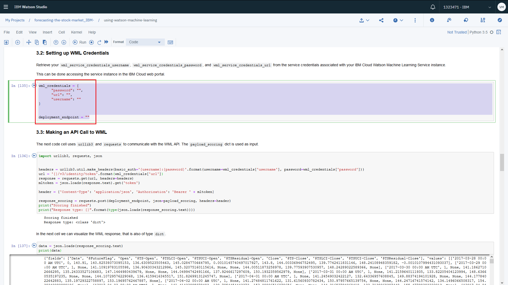

Paste the `Scoring End-Point` link you copied before into the `deployment_endpoint` variable, and your Watson Machine Learning credentials into `wml_credentials` variable. The WML credentials can be found inside the page of the service instance in the IBM Cloud web portal, as shown below:

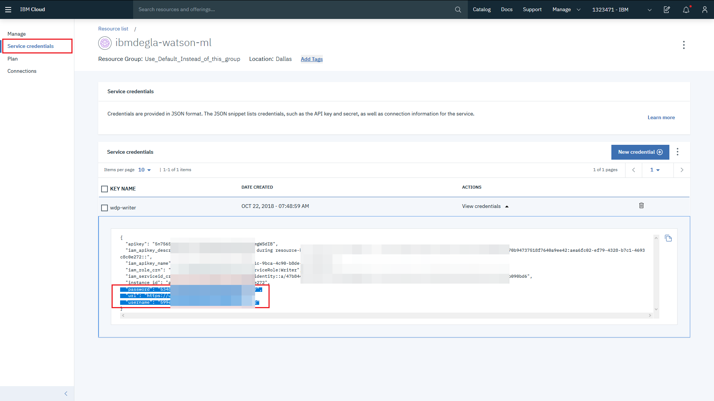

After setting these variables, you can then execute all remaining cells.

In the last section of the Notebook, it is possible to visually validate the predictions made using the model trained with Watson Studio Modeler Flow:

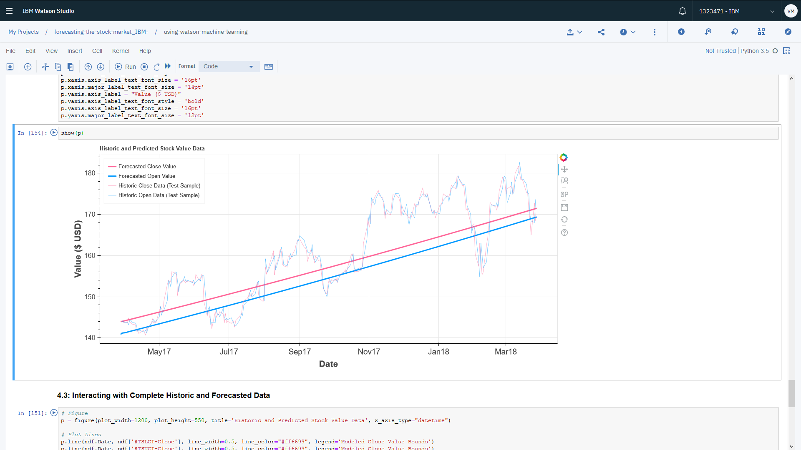

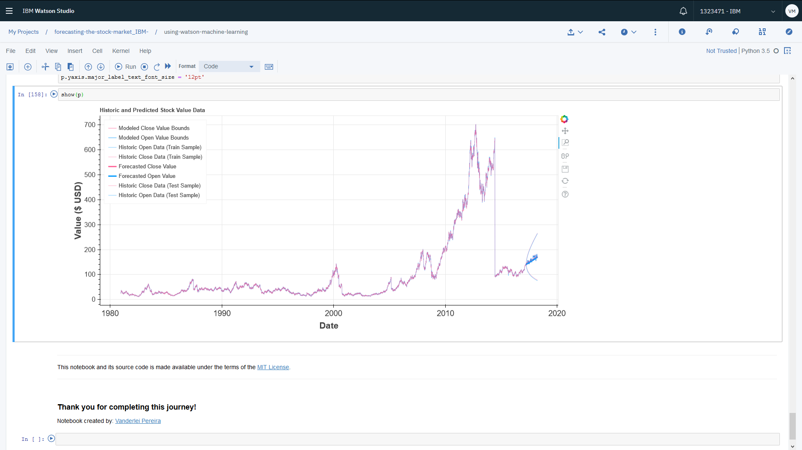

## Links

* [IBM Watson Studio](https://dataplatform.cloud.ibm.com)
* [IBM Watson Machine Learning](https://www.ibm.com/cloud/machine-learning)
* [IBM SPSS Modeler](https://www.ibm.com/products/spss-modeler)

## Learn more

* **Artificial Intelligence Code Patterns**: Enjoyed this Code Pattern? Check out our other [AI Code Patterns](https://developer.ibm.com/code/technologies/artificial-intelligence/).
* **AI and Data Code Pattern Playlist**: Bookmark our [playlist](https://www.youtube.com/playlist?list=PLzUbsvIyrNfknNewObx5N7uGZ5FKH0Fde) with all of our Code Pattern videos

## License

This code pattern is licensed under the Apache Software License, Version 2. Separate third party code objects invoked within this code pattern are licensed by their respective providers pursuant to their own separate licenses. Contributions are subject to the [Developer Certificate of Origin, Version 1.1 (DCO)](https://developercertificate.org/) and the [Apache Software License, Version 2](https://www.apache.org/licenses/LICENSE-2.0.txt).

[Apache Software License (ASL) FAQ](https://www.apache.org/foundation/license-faq.html#WhatDoesItMEAN)
